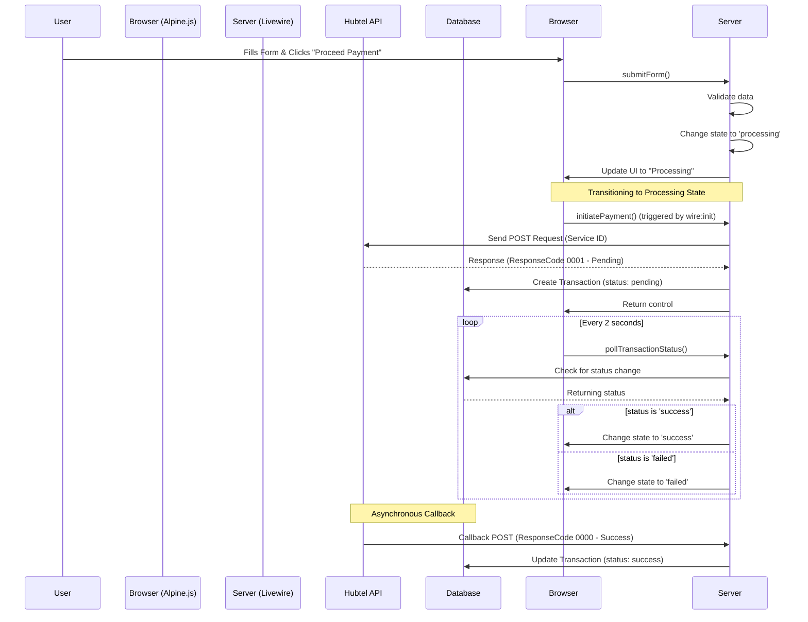

# SaganPay Payment Flow Documentation

This document describes the technical flow of a transaction in the SaganPay application, following the Hubtel state machine.

## 1. Sequence Diagram

## 2. State Management

The application uses a `state` variable to control the UI.

| State | Description | UI Block Visible |
|-------|-------------|------------------|
| `form` | Initial state where user fills details. | Payment Form |
| `processing` | Payment has been sent to Hubtel; waiting for mobile prompt/callback. | Processing Spinner |
| `success` | Hubtel callback confirmed payment. | Success Receipt |
| `failed` | API error or user cancelled/failed payment. | Error Message |

## 3. Potential Failure Points

1. **State Desync**: If the browser's Alpine.js state doesn't update when the server's Livewire state changes.
2. **Polling Efficiency**: If `wire:poll` starts too early or the `clientReference` is missing.
3. **Idempotency**: Ensuring the same payment isn't sent twice if the user refreshes during 'processing'.

## 4. Logical Flow in Code

1. **`submitForm`**: 
   - Validates input.
   - Sets `state` to `processing`.
   - Generates a unique `clientReference`.
2. **`initiatePayment`**:
   - Triggered automatically when the "Processing" UI is rendered.
   - Calls the `HubtelProvider` to perform the actual API request.
3. **`pollTransactionStatus`**:
   - Runs periodically in the background.
   - Only updates the UI when the database reflects a status change from the external callback.
